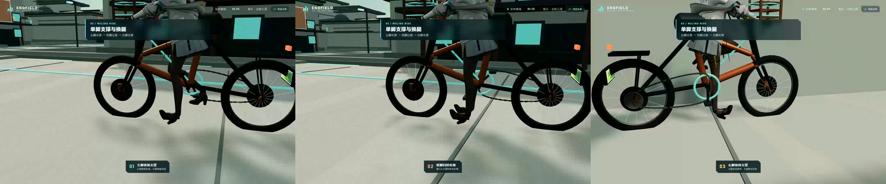

# 风起武陵 · 佩丽卡骑行计划

一个使用 Three.js 实时渲染的宣传型单页动画。佩丽卡沿方兴衢道路网骑行武陵城，场景包含三纵四横商业街、商铺前场、石构建筑、城门、巨钟亭、山地、河道、树木与动态能量装置。

自行车尺寸、驱动侧、齿比、转向方向和停车换脚规则记录在 [BICYCLE_DESIGN.md](BICYCLE_DESIGN.md)。

## 运行

```powershell
npm install
npm run dev
```

默认地址为 `http://localhost:5173/`。生产构建：

```powershell
npm run build
npm run preview
```

`dist/` 是完整静态产物，可将该目录部署到任意静态站点。

仓库已配置 GitHub Pages 自动部署。推送到 `main` 后，工作流会构建 `dist/` 并发布到：

https://susieglitter.github.io/perlica/

页面右上角的“项目仓库”入口指向 https://github.com/SusieGlitter/perlica 。

`preview/desktop.png` 与 `preview/mobile.png` 是本地验收截图。

启动开发服务器后，可运行 `npm run verify` 自动检查传动齿比、左右转向、倒车脚部动作、建筑碰撞、巡航回归、音频交付和桌面/移动端截图。

## 演示视频

约 140 秒的《风起武陵》宣传片位于 `video/wuling-perlica-demo.mp4`，展示地图、自动巡航、
自由操控、单脚支撑与换腿、倒车、传动结构、城市车细节和程序化武陵场景。旁白使用 QwenTTS
复刻公开佩丽卡中文语音片段中的音色，视频画面由 Playwright 自动录制，最终使用
FFmpeg 合成原创配乐《武陵云道》。录制脚本会启用 ANGLE/D3D11 GPU，并在写入成片前
检查源画面平均帧率和有效变化帧率，避免软件渲染产生重复帧和卡顿。

```powershell
python tools/generate_narration.py enroll
python tools/generate_narration.py synthesize
npm run capture:demo
npm run build:video
```

详细来源、时间线和验证结果见 `video/README.md`、`video/NARRATION.md` 与
`video/build-report.json`。完整版 `ffmpeg` 不属于仓库依赖，脚本默认从
`.cache/tools/ffmpeg/bin/` 查找；也可通过 `FFMPEG_PATH` 和 `FFPROBE_PATH` 指定。



## 交互

- `开始骑行`：收起标题，进入完整导览视角。
- 播放按钮：暂停或继续路线与骨骼动画。
- `巡游 / 自由`：在自动环城导览和用户操控之间切换。
- 自由模式下使用 `WASD` 或方向键控制方向和油门，`Shift` 加速，空格刹车，`S` 低速倒车，`F` 快速切换模式。
- 自由模式下按 `B` 拨响车铃。
- 移动端的自由模式会在画面下方显示转向、刹车和油门触控区。
- 移动端自由模式同时提供独立的倒车触控键。
- `跟随 / 低机位 / 远景`：切换三套镜头。
- `缓行 / 巡航 / 疾风`：切换骑行速度。
- 底部路线条：拖动调整骑手在环线上的位置。
- 配乐按钮播放本地原创曲目《武陵云道》，不会访问外部流媒体。

## 实现说明

- 主角模型：带骨骼的 GLB，运行时通过髋、膝、踝、肩、肘等骨骼节点生成踩踏与握把姿态。
- 武陵场景：全部由 Three.js 几何体、程序纹理与合并网格生成，不依赖在线地图或远程模型。
- 路线与活动区：闭环 Catmull-Rom 曲线连接方兴衢外环，三纵四横道路、中心前场和两处集结点扩展为矩形可骑行区域。
- 自动巡航：使用前视点、横向偏差和 PID 舵角控制，切回巡游时从当前位置原地返回最近路线，不再瞬移。
- 骑行状态机：包含加速、制动、正向踩踏、低速倒车、转向、压弯、悬挂压缩和落脚支撑；移动使用 10 cm 子步与建筑碰撞体，降低高速穿越风险。
- 全新自行车：重新建模为适合佩丽卡约 1.71 米身高的低跨城市车，1.46 米轴距、约 1.06 米座高；驱动侧位于骑手右侧，包含独立车架、前叉、转向组、牙盘曲柄、飞轮、链条、车筐、新能源车牌、碟刹和车铃。
- 自行车传动：车轮角度和踩踏角度由 `18/46` 飞轮/牙盘齿比统一驱动，前进时两者同向，左右脚踏严格相差 180°；曲柄使用真实旋转总成，而不是反向三角函数摆点。
- 骑手姿态：腿部使用前后向平面 IK 将脚端约束到踏板；停车方向由横向重心偏置决定，换脚时先双脚着地再抬起非支撑脚；膝部保持向前，双手保持在车把握把附近。
- 裙摆行为：裙摆与飘带骨骼会根据速度、转向和落脚状态产生有限幅摆动，降低骑行和停车时的刚性交叠。
- 武陵建筑：加入城墙、坡顶瓦檐、城门题额、巨钟亭、灯笼、河桥和青色协议能源塔。
- 配乐：原创曲目《武陵云道》，时长 113.3 秒，由主题旋律、古琴式拨弦、竹笛式音色、低弦、框鼓、金属点缀和巨钟动机合成；源文件位于 `public/assets/audio/wuling-cloudway.wav`，生成脚本位于 `tools/generate_wuling_music.py`，仅依赖 Python、NumPy 和标准库。
- 移动端：控制面板与说明区重排；低性能视口会降低像素比并关闭部分后处理效果。
- 小地图：左上角使用终末地式浅色战术底图，实时绘制方兴衢道路、街区体量、巡航线、任务节点、车辆位置和车头方向。

## 资产来源

角色模型使用 Sketchfab 上的公开模型：

- 名称：`Perlica / Arknights Endfield`
- 作者：`Abcxyz51`
- 来源：https://sketchfab.com/3d-models/perlica-arknights-endfield-ba27991531bd4b8fa77a73b8e66d8ed2
- 许可：Creative Commons Attribution 4.0
- 许可地址：https://creativecommons.org/licenses/by/4.0/

模型已被转换为自包含 GLB，并在网页中运行时进行骨骼摆放、材质参数调整和动画驱动。角色与《明日方舟：终末地》相关知识产权归其权利人所有；本仓库是非官方宣传动画实现。

武陵城场景未打包第三方地图或截图。空间设计参考了本地方兴衢俯视图、街景资料以及公开客户端资源路径清单中的 `map02` 命名，并由当前仓库中的程序化几何体重新构建。详细来源、版本和验证状态见 `WORLD_REFERENCE.md`。

网页代码、场景程序化资产和自行设计的宣传文案为该项目的一部分。运行时无需联网。
